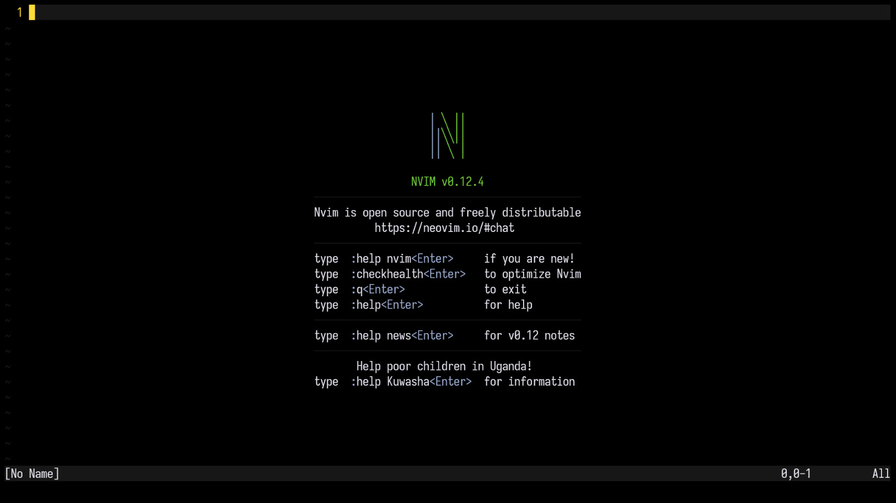
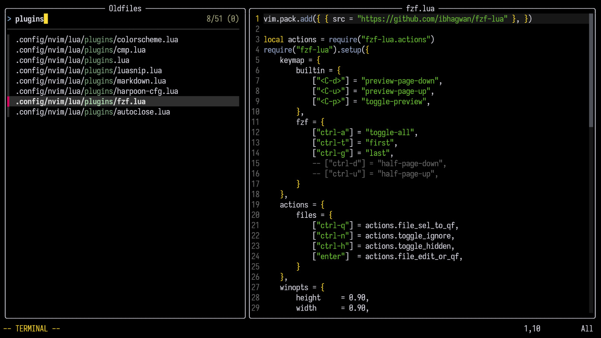
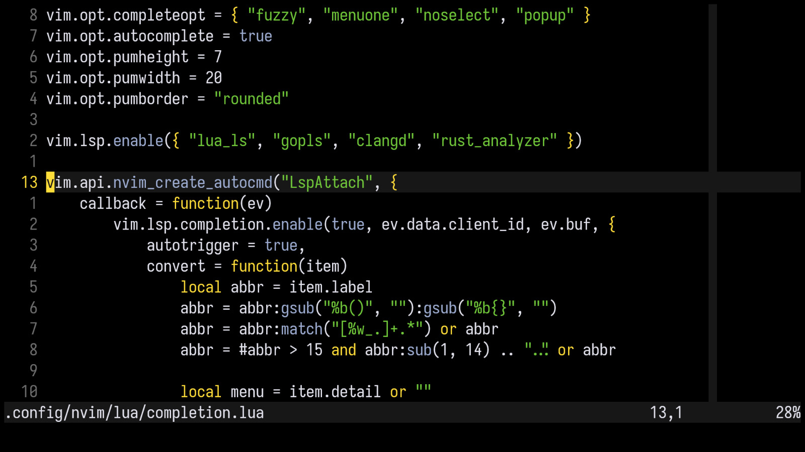

## Gruber Black
Gruber Black is a dark theme for NeoVim based on a slightly modified version of [Rexim's Gruber Darker](https://github.com/rexim/gruber-darker-theme) theme.

<details>
<summary>screenshots</summary>





</details>

## Instalation
<details>
<summary>vim.pack</summary>

```lua
vim.pack.add({
    { src = "https://github.com/aquilesrc/gruber-black.nvim" },
})
```

</details>

<details>
<summary>lazy.nvim</summary>

```lua
{
    "aquilesrc/gruber-black",
    lazy = false,
    priority = 1000,
}
```

</details>

## Usage

```lua
vim.cmd.colorscheme("gruber-black")
```

## Config
Default options:
```lua
require("gruber-black").setup({
    transparent = false,
    bold = false,
    italic_strings = false,
    italic_comments = false,
})
```

## Palette
|           Highlights            | Colors  |
| :-----------------------------: | :-----: |
|               fg                | #e4e4ef |
|               bg                | #000000 |
| accent1 (gruber-darker-yellow)  | #ffdd33 |
| accent2 (gruber-darker-niagara) | #9dadd1 |
| accent3 (gruber-darker-quartz)  | #95a99f |
|             string              | #73c936 |
|              gray               | #343434 |
|           light_gray            | #6f6f6f |
|            dark_gray            | #181818 |
|              error              | #f43841 |
|             warning             | #ffdd77 |
|              hint               | #9e95c7 |
|              info               | #96a6c8 |

